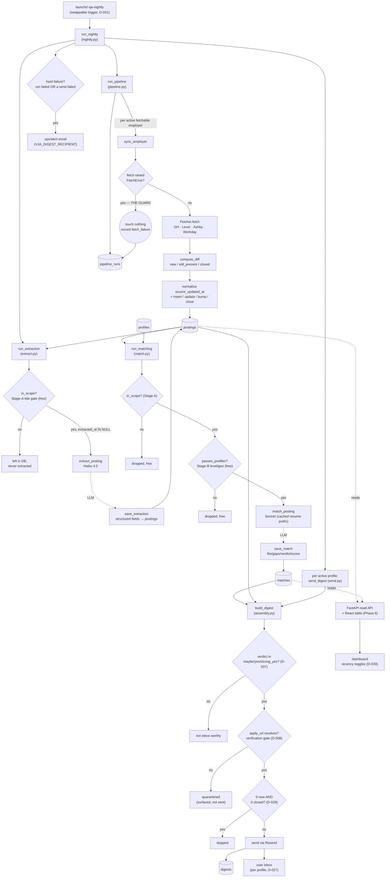
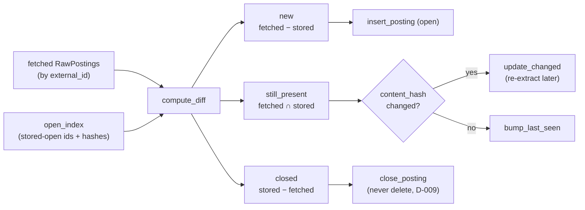
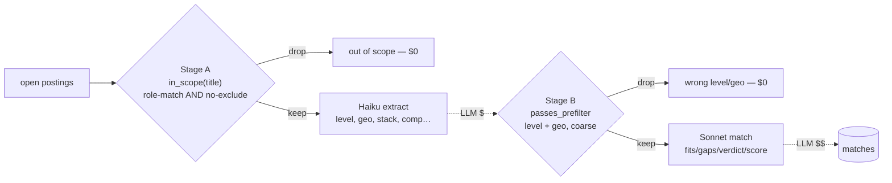
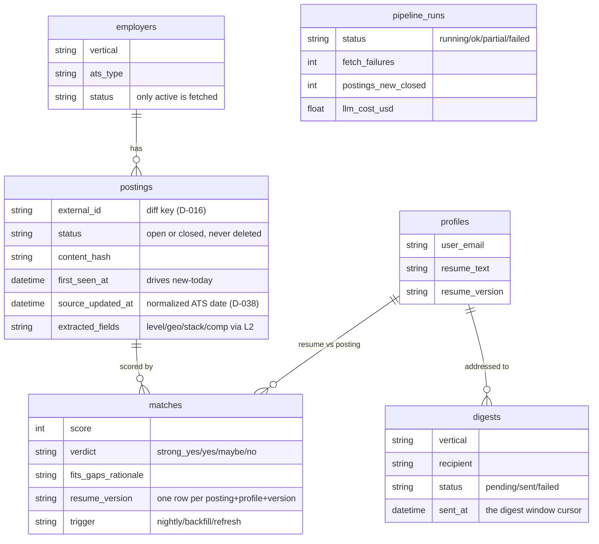

# 12 — Dataflow map

A visual model of how data moves through the system, from the nightly trigger to the two
read surfaces. This is a **derived map**, not a spec: where it disagrees with the build
specs (`docs/04+`), the specs win (CLAUDE.md order of authority). It exists so a new
reader — or a future session — can see the whole loop on one page before diving into a
module.

Scope: the state of the code as built through Phase 5 (Layer-2 extraction + matching +
rationale digest). Phase 6 (the read-only dashboard) is shown as the second consumer of
the same precomputed tables; its query helpers are noted where they will attach.

## Legend

- **Rounded box** — a function / stage (the code that moves data).
- **Cylinder** — a persistent table (a store; see §"Data stores").
- **Diamond** — a gate / branch (a decision that drops or routes data).
- **Dashed edge** — an LLM call (metered spend; everything else is free/deterministic).
- `L1` = Layer 1 (deterministic ATS spine) · `L2` = Layer 2 (LLM) · the diff key is
  `external_id` throughout (D-016).

## The whole loop (one nightly run)

The single most important edge is `guard -->|yes| noop`: a failed fetch makes **zero**
changes. The diff cannot tell "the board is empty today" from "the fetch 500'd," so the
caller must only diff a *successful* fetch — otherwise one transient error mass-closes a
company's postings and ships a digest claiming its jobs all died (`diff.py`, `docs/05`).

## Layer 1 in detail — `sync_employer`

Per employer, per night. Pure set arithmetic over `external_id`, then four write paths,
each of which refreshes the normalized `source_updated_at` so the existing corpus
self-heals (D-038).

`content_hash` is over `title + location + description` (`hashing.py`): a changed hash
re-flags the posting for Layer-2 re-extraction; an unchanged hash is a cheap `last_seen`
bump.

## The two cheap gates (cost discipline, D-023)

LLM spend is governed by two free deterministic gates *before* each model tier. Extraction
is the cheap tier (Haiku); only its survivors that also clear Stage B reach the strong
tier (Sonnet) — the one real cost.

Both gates are **deliberately coarse and err toward keeping** (`unknown` level or location
passes): dropping a plausible match is worse than spending a few cents to let the model
rule it out. Both gates' knobs are vertical config (`config/verticals/*.yaml`), never code
(D-004). Sonnet's resume + instructions are a **cached prefix**, so the per-posting fields
are the only volatile tokens — the backfill burst pays the resume once.

## Data stores (the five core entities + the run log)

`sources` (non-employer feeds, e.g. HN Who's-Hiring) exists in the model but is a Phase-8
concern — no live ingestion path yet, so it's omitted from the flow above.

## The two delivery surfaces

Both read the **same** nightly-computed `postings` + `matches`. Nothing fetches live at
read time; the dashboard is "a window onto the DB," the digest is "the same window,
pushed."

| | **Push — email digest** (primary) | **Pull — dashboard** (Phase 6) |
|---|---|---|
| Trigger | end of nightly pipeline | user opens the page |
| Code | `digest/` → Resend | FastAPI read API → React table |
| Window | since `last_sent_at` for this recipient | recency toggles: new today / 1wk / 2wk / all open (D-030) |
| Window key | `first_seen_at` (so it equals the digest) | `source_updated_at` OR `first_seen_at` fallback (D-024/D-030) |
| Gating | relevant verdict + verification + non-empty | full open set (read-only) |

**Phase-6 attach point:** the dashboard needs an `open_postings_in_window` query helper
(window = `source_updated_at` in-window OR `first_seen_at` fallback; *new today* uses
`first_seen_at`) plus a `(status, source_updated_at)` index — the next block (A2 / D-039).
The normalized `source_updated_at` it keys on is already populated by every L1 write path
and by extraction (D-038), so no new backend date work reorders the dashboard.

## Stage → module → store → decisions

| Stage | Module | Reads | Writes | Key decisions |
|---|---|---|---|---|
| Trigger | `nightly.py` | — | `pipeline_runs` (LLM totals) | D-031 (swappable scheduler), D-025 (cloud cutover) |
| L1 fetch+diff | `pipeline.py`, `diff.py`, `fetchers/` | `employers`, `postings` | `postings`, `pipeline_runs` | D-016 (diff key), D-009 (never delete), THE GUARD |
| Date normalize | `dates.py` | — | `postings.source_updated_at` | D-038, D-024/D-030 |
| L2 extract | `extract.py`, `scope.py` | `postings` | `postings` (fields) | D-023 (Stage A), D-005 (cheap tier) |
| L2 match | `match.py`, `prefilter.py` | `postings`, `profiles` | `matches` | D-023 (Stage B), D-005/D-007 (strong tier, say no) |
| Push | `digest/` | `postings`, `matches`, `profiles`, `digests` | `digests`, inbox | D-027/D-037 (per-profile), D-008 (verify), D-028 (skip empty) |
| Pull | FastAPI + React (Phase 6) | `postings`, `matches` | — | D-030 (recency toggles), docs/11 ((vertical, profile) seam) |
